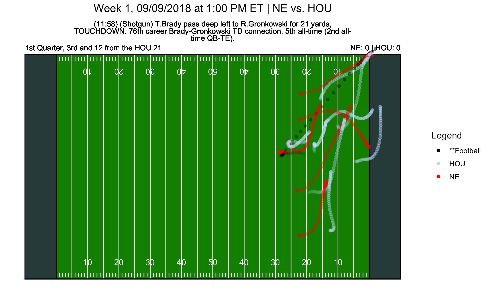
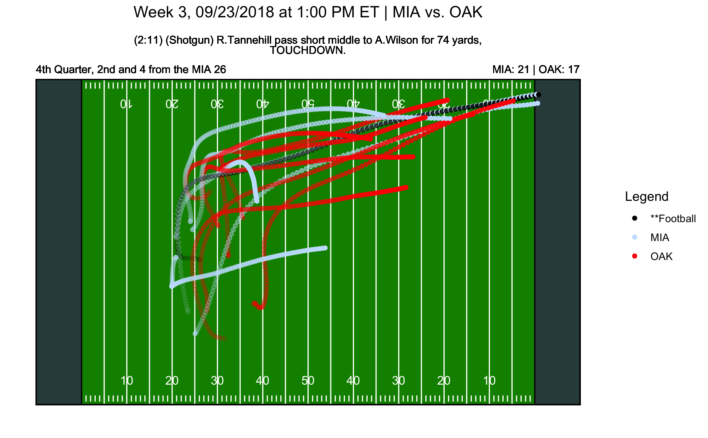

# STA 523 :: Project - Team CRYM

## Inspiration

Our project is inspired by the NFL's Big Data Bowl 2021 on Kaggle, which challenges teams to 
generate novel insights on defending passing plays. While this project is not specifically 
aimed at this goal, the rich player tracking data provided by the competition enables us to 
both build interesting plots (animated and still) and a predictive model. 

## Main objective

This project has 2 main objectives:

- Generate animated plots based on user input to visualize NFL plays from a bird's-eye view
- Predict the outcome of a play (in terms of yardage gained) based on solely pre-snap information

## Data

Our data, sourced from the NFL's Big Data Bowl 2021 on Kaggle, contains 4 types of files.
Please note that all information in these files pertains to passing plays in the 2018 NFL season:

- Game data: Logistics about each game, including the time, data, and teams playing
- Play data: One line summary for each play, including context (e.g., location on field, 
time remaining in game, score), team formations, and play outcome (e.g., yardage gained)
- Tracking data: Position (i.e., x and y coordinates) and movement (e.g., speed, acceleration) 
measurements for each player at points in time. Offensive and defensive linemen are largely excluded
- Player data (not used for this project): Identifying information for NFL players

Please see below for a couple of static plots, which demonstrate the richness of the tracking data:

## Methods

To reproduce this work, one can run these R scripts in the following order

   1. Data_processing/sample_data.R
   2. Data_processing/tracking_features.R
   3. Data_processing/data_filtered.R
   4. Data_processing/gen_test_validation_sets.R
   5. Models/GradientBoostingModel.R
   6. Models/quantile_reg.R
   
This repository already contains the output of these scripts, and the Shiny app can be launched from the nfl_dash folder.

#### Animated plotting

The Tracking data files are ~ 2GB in total, which is too large to include on shinyapp.io 
with a free account. As a result, we (1) limit our animations to only AFC East teams 
(Buffalo Bills, Miami Dolphins, New England Patriots, New York Jets) and (2) take a 
30% stratified sample from each week. With this reduced data set, we are then able 
to produce animations with gganimate. 

In the Shiny app, users are able to specify a week, team, and play outcome. If no plays 
in our sampled data set fit the criteria, a warning message is returned. If multiple 
plays in our sampled data set fit the criteria, then one of the plays is randomly 
chosen to be displayed in the plot.

#### Predictive modeling

To build our predictive model we wanted to extract as much information from 
our play data as well the player tracking data. 

From the play data we engineered features that counted the number of players
per position on the field for the play. We include yards to go for a first down,
the quarter, the down, the team in possession of the football, the position
on the field, the offensive formation, number of pass rushers, number of 
defenders in the box, the visitor and home score, and the type of quarter back
drop back.

From the player tracking data we generated features to convey defensive 
spatial information when the ball was snapped. The variables created include 
the individual variances for the x and y coordinates as well their covariances
for the defensive players on the field. We also calculate the average distance
from the line of scrimmage for each defensive position on the field.
On top of this we used the player data to calculate the average age, height, 
and weight of the defensive backs and line backers on the field for each play.
The feature generation from tracking data can be found in `tracking_features.R`.

In the model development stage we attempted a random forest, gradient boosted
tree, as well a elastic net regression. Each method produce dissatisfying results
generating an root mean squared error of no less than 9. Given the difficulty 
in producing accurate point estimates we opted for a quantile regression. We
predict the 12.5% quantile and the 87.5% quantile to estimate a 75% confidence 
region for the expected yards gained. For our point estimate we model the 
median yards gained using a quantile regression. 

For the gradient boosted model, in addition to the predictors we used for the
linear regression model, we also included variables that are factors. Some of 
the features include `quarter`, `down`, `week`, `possessionTeam`,
`offenseFormation`, `defendersInTheBox`, `typeDropback`, and etc., and we are
using them to predict `offensePlayResult`.
We found that the gradient boosted model has the relatively smaller RMSE, though 
it's still pretty large for a predictive result. We can conclude that it is
difficult to predict the yards gained by the offense (excluding penalty yardage)
for the NFL games, which is reasonable since the plays are very competitive.
We created a prediction interval for this model in particular using the 
`offensePlayResult` in the test set plus or minus the RMSE. The point estimates
and the prediction intervals are all included in the 
`merged_data_prediction_boost.csv` file under the `data` folder.
For the animation in the Shiny app, however, we decided to use the quantiles 
and the point estimates we got from the quantile regression because it is 
easier to interpret with a fixed confidence level about the predictions,
and it is also more intuitive for the app users to understand.

## Results

The shiny app can be viewed at this [link](https://rob-kravec.shinyapps.io/nfl_dash/?_ga=2.56872490.1609727935.1605974938-1036932365.1605974938).

When evaluating our model on the hold out test set, 47% of the new observations
were within their 75% predicted region (constructed by the estimated quantiles). 
In this case the test set was taken from our training data to evaluate or model.

When using the entire training set to train the quantile regressions and 
using the true validation, the plays held out to generate the animation, 83%
of the data point were within their 75% region. Note that these
estimates might change with the sample generated. It should also be noted that
the result may be unstable as the quantile regression warns the solution is not
unique. This is an area for future exploration and improvement.

To conclude, the predictive performance of our model is very poor. This is not
unexpected as almost all of our feature variables were uncorrelated with response
variable, the yards gained on the play. There are a couple points to consider.

1) A large number of plays are incomplete and have 0 yards gained.

2) There are a non insignificant amount of large break away plays. 

Clearly our model over compensates for the large number of 0 yards gain and is 
unable to capture the plays with larger yards gain as almost all our predictions
are between 0 and 10 yards.

It is important to mention that this is a difficult problem to solve and, in 
fact, front offices have yet to find an adequate solution.

## References

- NFL Big Data Bowl 2021 (data, notebooks of competition competitors for 
visualziation inspiration): https://www.kaggle.com/c/nfl-big-data-bowl-2021/overview
- Stratified sampling: https://www.rdocumentation.org/packages/splitstackshape/versions/1.4.8/topics/stratified
- Gradient Boosting model: https://datascienceplus.com/gradient-boosting-in-r/
- Embed gganimation in shiny: https://stackoverflow.com/questions/35421923/how-to-create-and-display-an-animated-gif-in-shiny
